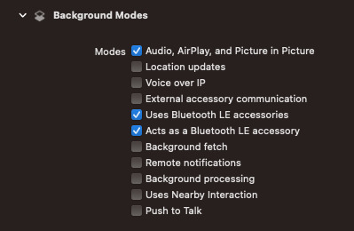

# BluetoothMIDI Example (iOS SwiftUI)

This example demonstrates connecting to Bluetooth MIDI devices on iOS and receiving events.

Events received from all MIDI output endpoints are automatically logged to the console.

## Build Note

⚠️ If Xcode builds but the app does not run, it may be because Xcode is defaulting to the wrong Scheme. Ensure the example app's Scheme is selected then try again.

## Key Features

- This example demonstrates the use of Apple's Bluetooth MIDI classes to allow your app to configure Bluetooth MIDI connections.

## App Target Entitlements

- Even though Bluetooth MIDI largely operates via Core MIDI, you still need to give your app appropriate entitlements.
- Add the **Background Modes** entitlement and enable:
  - [x] Audio, AirPlay and Picture in Picture
  - [x] Uses Bluetooth LE accessories
  - [x] Acts as a Bluetooth LE accessory

## Info.plist Keys

- The following key is required in the info.plist file with a string containing a reason for allowing your app access to bluetooth connectivity.
  - `NSBluetoothAlwaysUsageDescription`

## Operation

Once Bluetooth connectivity is implemented (see examples above), Bluetooth MIDI devices' ports simply show up as MIDI input or output endpoints in the system. Access them by getting these properties on your `Manager` instance:

- `midiManager.endpoints.inputs`
- `midiManager.endpoints.outputs`
