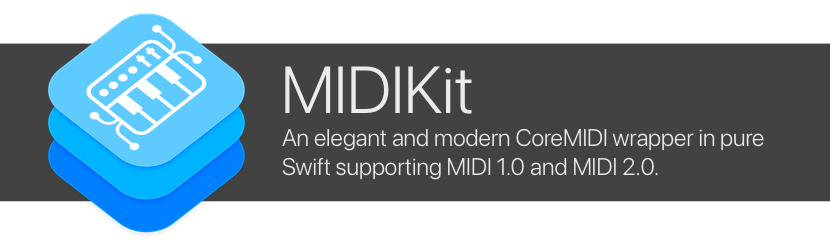

# MIDIKit

    

An elegant and modern CoreMIDI wrapper in pure Swift supporting MIDI 1.0 and MIDI 2.0.

- Modular, user-friendly I/O
- Automatic MIDI endpoint connection management and identity persistence
- Strongly-typed MIDI events that seamlessly interoperate between MIDI 1.0 and MIDI 2.0
- Automatically uses appropriate Core MIDI API and defaults to MIDI 2.0 on platforms that support it
- Supports Swift Playgrounds on iPad and macOS
- Full documentation available in Xcode Documentation browser, including helpful guides and getting started information

## Abstractions

Additional abstractions for MIDI extensions can be found in MIDIKit:

- Reading/writing Standard MIDI Files (SMF)
- Control Surface protocols (HUI, etc.)
- Synchronization protocols (MTC, etc.)

## Getting Started

The library is available as a Swift Package Manager (SPM) package.

Use the URL `https://github.com/orchetect/MIDIKit` when adding the library to a project or Swift package.

See the [getting started guide](https://orchetect.github.io/MIDIKit/documentation/midikit/midikit-getting-started) for a detailed walkthrough of how to get the most out of MIDIKit.

## Documentation

See the [online documentation](https://orchetect.github.io/MIDIKit/) or view it in Xcode's documentation browser by selecting the **Product → Build Documentation** menu.

This includes a getting started guide, links to examples, and troubleshooting tips.

## System Compatibility

- Xcode 14.0 / macOS 12.0 are minimum requirements to compile
- Once compiled, MIDIKit supports macOS 10.12+ and iOS 10.0+.

  tvOS and watchOS are not supported (as there is no Core MIDI implementation) but MIDIKit will build successfully on those platforms in the event it is included as a dependency in multi-platform projects.

## Author

Coded by a bunch of 🐹 hamsters in a trenchcoat that calls itself [@orchetect](https://github.com/orchetect).

## License

Licensed under the MIT license. See [LICENSE](https://github.com/orchetect/MIDIKit/blob/master/LICENSE) for details.

## Sponsoring

If you enjoy using MIDIKit and want to contribute to open-source financially, GitHub sponsorship is much appreciated. Feedback and code contributions are also welcome.

## Community & Support

Please do not email maintainers for technical support. Several options are available for questions and feature ideas:

- Questions and feature ideas can be posted to [Discussions](https://github.com/orchetect/MIDIKit/discussions).
- If an issue is a verifiable bug with reproducible steps it may be posted in [Issues](https://github.com/orchetect/MIDIKit/issues).
- The [AudioKit](https://github.com/AudioKit/AudioKit) discord `#midikit` channel is also a place to find help if Discussions and documentation don't contain an answer. (Invitation is necessary)

## Contributions

Contributions are welcome. Posting in [Discussions](https://github.com/orchetect/MIDIKit/discussions) first prior to new submitting PRs for features or modifications is encouraged.
