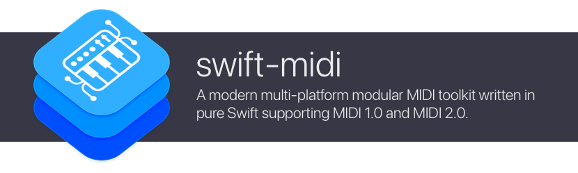
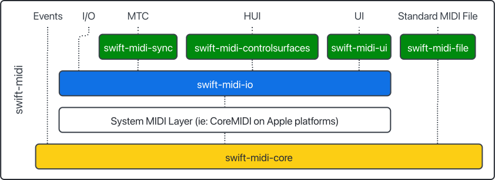

# SwiftMIDI

[](https://swiftpackageindex.com/orchetect/swift-midi) [](https://swiftpackageindex.com/orchetect/swift-midi) [](https://github.com/orchetect/swift-midi/blob/main/LICENSE)

A modular multi-platform MIDI toolkit written in pure Swift supporting MIDI 1.0 and MIDI 2.0.

- Strongly-typed MIDI events that seamlessly interoperate between MIDI 1.0 and MIDI 2.0
- Modular, user-friendly I/O with automatic MIDI endpoint connection management and identity persistence
- Swift 6 strict concurrency compliant
- Backwards compatible to macOS 10.13+, iOS/iPadOS 12.0+ and visionOS 1.0+
- Full documentation available, including guides and example code



## Core Repositories

| Repository                                                   | Description           | Apple | Linux | Android | Windows |
| :----------------------------------------------------------- | :-------------------- | :---: | :---: | :-----: | :-----: |
| [swift-midi-core](https://github.com/orchetect/swift-midi-core) | MIDI events & types * |   🟢   |  🚧 †  |   🚧 †   |    -    |
| [swift-midi-io](https://github.com/orchetect/swift-midi-io)  | MIDI I/O extension    |  🟢 ‡  |   -   |    -    |    -    |

`*` All repositories depend on **SwiftMIDI Core**.

`†` Support for indicated platforms is either planned or WIP.

`‡` macOS, iOS, and visionOS have CoreMIDI I/O support in the operating system. tvOS and watchOS do not have MIDI I/O.

## Extension Repositories

Extensions add optional features.

| Repository                                                   | Description                           | Apple | Linux | Android | Windows |
| :----------------------------------------------------------- | :------------------------------------ | :---: | :---: | :-----: | :-----: |
| [swift-midi-controlsurfaces](https://github.com/orchetect/swift-midi-controlsurfaces) | Control surface protocols (HUI, etc.) |   🟢   |  🚧 †  |   🚧 †   |    -    |
| [swift-midi-file](https://github.com/orchetect/swift-midi-file) | Standard MIDI File read/write         |   🟢   |  🚧 †  |   🚧 †   |    -    |
| [swift-midi-sync](https://github.com/orchetect/swift-midi-sync) | Sync extensions (MTC, etc.)           |   🟢   |  🚧 †  |   🚧 †   |    -    |
| [swift-midi-ui](https://github.com/orchetect/swift-midi-ui)  | SwiftUI user interface controls       |   🟢   |   -   |    -    |    -    |

`†` Support for indicated platforms is either planned or WIP.

## Getting Started

The library and its extensions are available as Swift Package Manager (SPM) packages.

### Entire Library (All Extensions)

To get started with all extensions:

1. Add the **swift-midi** umbrella repo as a dependency.

   ```swift
   .package(url: "https://github.com/orchetect/swift-midi", from: "1.0.0")
   ```

2. Add **SwiftMIDI** to your target.

   ```swift
   .product(name: "SwiftMIDI", package: "swift-midi")
   ```

3. Import **SwiftMIDI** to use it. This will import all extensions.

   ```swift
   import SwiftMIDI
   ```

4. See the [getting started guide](https://swiftpackageindex.com/orchetect/swift-midi/main/documentation) and the dedicated [code examples](https://github.com/orchetect/swift-midi-examples) repository to see the library in action.

### Individual Extensions

To use only specific features without importing all extensions, use the extension repositories as dependencies instead of the **swift-midi** umbrella repository. This can help reduce compile time and shrink the total dependency size.

## Documentation

Full online documentation is available for all of the extension repositories. Check the README in each repository for a link to its documentation.

For new users, see the [getting started guide](https://swiftpackageindex.com/orchetect/swift-midi/main/documentation) and the dedicated [code examples](https://github.com/orchetect/swift-midi-examples) repository to see the library in action.

## Roadmap

Support for additional platforms may be added in future.

## Author

Coded by a bunch of 🐹 hamsters in a trenchcoat that calls itself [@orchetect](https://github.com/orchetect).

## License

Licensed under the MIT license. See [LICENSE](https://github.com/orchetect/swift-midi/blob/master/LICENSE) for details.

## Sponsoring

If you enjoy using **SwiftMIDI** and want to contribute to open-source financially, GitHub sponsorship is much appreciated. Feedback and code contributions are also welcome.

## Community & Support

Please do not email maintainers for technical support. Several options are available for issues and questions:

- Questions and feature ideas can be posted to [Discussions](https://github.com/orchetect/swift-midi/discussions).
- If an issue is a verifiable bug with reproducible steps it may be posted in [Issues](https://github.com/orchetect/swift-midi/issues).

## Contributions

Contributions are welcome. Posting in [Discussions](https://github.com/orchetect/swift-midi/discussions) first prior to new submitting PRs for features or modifications is encouraged.

## Code Quality & AI Contribution Policy

In an effort to maintain a consistent level of code quality and safety, this repository was built by hand and is maintained without the use of AI code generation.

AI-assisted contributions are welcome, but must remain modest in scope, maintain the same degree of quality and care, and be thoroughly vetted before acceptance.

## Legacy

This repository was previously a mono-repo known as **MIDIKit**. In April of 2026 it was renamed **swift-midi** and its individual components were split off into their own extension repositories.